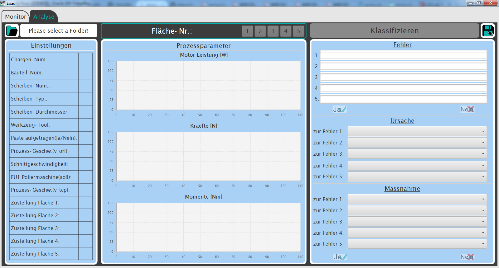
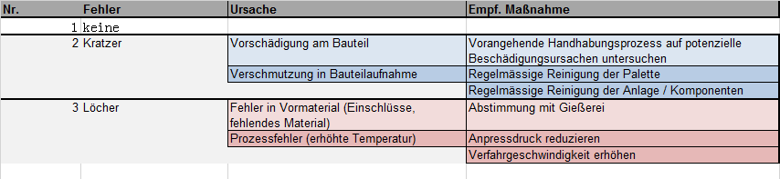

# java-GUI-EPAS

This is my Projektarbeit, a graphical user interfaces for a robot aided production system "EPAS".

IDE: Eclipse  
language: java, javafx, fxml  
database: SQLite

my library:
Klss2: simple matlab function

external libraries:  
javabuilder: api for matlab function  
sqlite-jdbc: api for sqlite-database

 
 

/Beispiel is used for testing.

